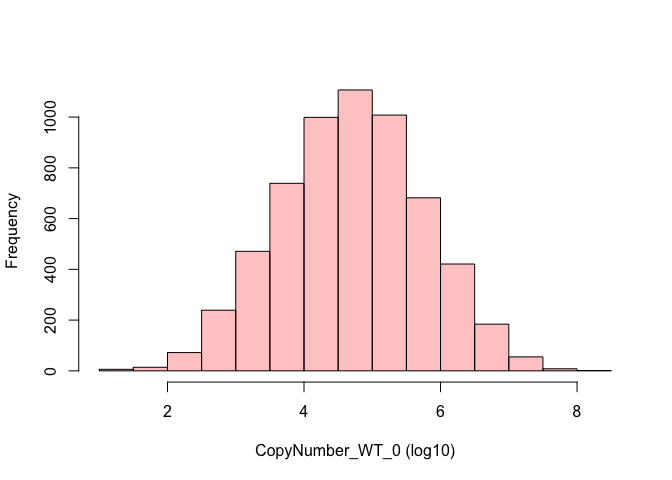

R package: proteinRuler
================
Guillaume Voisinne
2019 - 03 - 29

[](https://travis-ci.org/VoisinneG/queryup)

R Package : proteinRuler
========================

Compute protein abundance from protein intensities using the 'protein ruler' methodology (See article by [Wisniewski et. al](https://doi.org/10.1074/mcp.M113.037309)).

Install
-------

Install the package from github using devtools:

``` r
devtools::install_github("VoisinneG/proteinRuler")
library(proteinRuler)
```

Examples
--------

Import a dataset containing protein intensities and protein IDs and compute protein abundances :

``` r
data("proteinGroups_CD4_Tcells")
res <- proteinRuler(proteinGroups_CD4_Tcells, DNA_mass_per_cell = 5.5209e-12, show_progress = FALSE)
names(res)
```

    ## [1] "copy_number" "summary"     "annotations"

``` r
print(res$summary)
```

    ##             column median_Intensity sum_Intensity sum_Intensity_histones
    ## 1   Intensity WT_0        369090000  2.206908e+13           512146984000
    ## 2 Intensity WT_030        338910000  1.994321e+13           456856460100
    ## 3 Intensity WT_120        294340000  1.662875e+13           506685089500
    ## 4 Intensity WT_300        280020000  1.612613e+13           366101939300
    ## 5 Intensity WT_600        262470000  1.448206e+13           342576488300
    ##   percentage_mass_histones protein_mass_per_cell_pg
    ## 1                 2.320654                 237.9028
    ## 2                 2.290787                 241.0045
    ## 3                 3.047043                 181.1888
    ## 4                 2.270241                 243.1856
    ## 5                 2.365524                 233.3902

Plot copy number distribution :

``` r
cond <- "CopyNumber_WT_0"
hist(log10(res$copy_number[[cond]]), main = "", xlab = paste(cond, "(log10)"), col = rgb(1,0,0,0.25))
```


